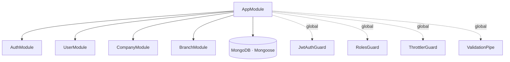
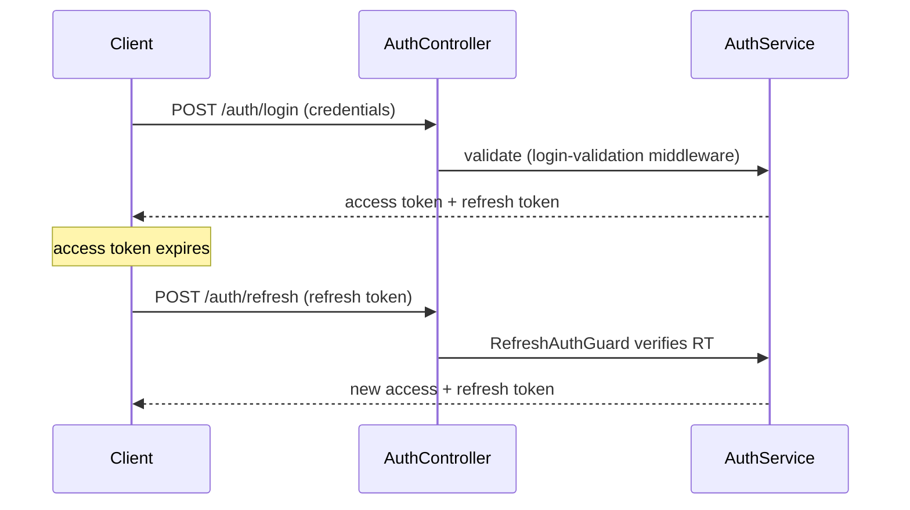
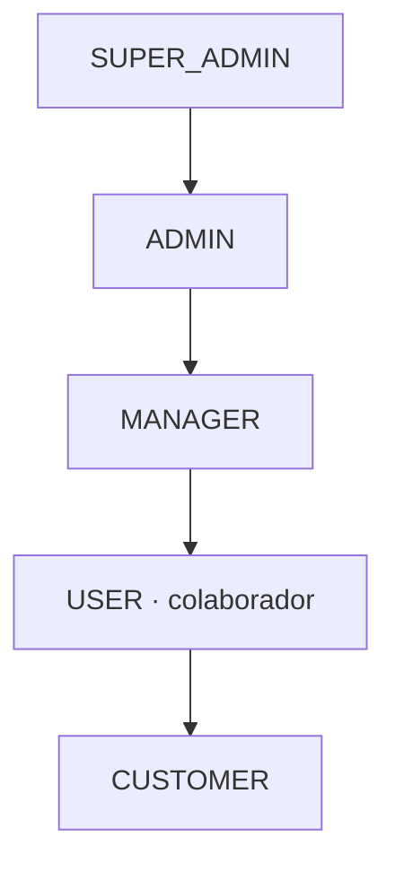
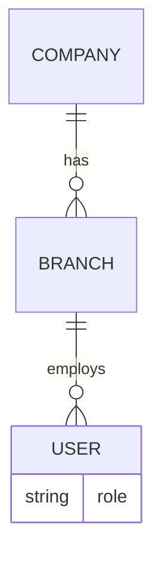

# Architecture

## Module graph

NestJS application composed of isolated feature modules wired through dependency injection. Global guards and pipes are registered once at the root and apply across every module.



## Request pipeline

Each incoming request passes through a layered defense before reaching business logic. The application is **deny-by-default**: `JwtAuthGuard` runs globally and routes must explicitly opt out with `@Public()`.

```mermaid
graph LR
  Req[Request] --> Helmet[helmet]
  Helmet --> Throttle[Throttler<br/>rate limit]
  Throttle --> AuthG[JwtAuthGuard]
  AuthG --> RolesG[RolesGuard<br/>@Roles]
  RolesG --> Pipe[ValidationPipe<br/>whitelist + forbid]
  Pipe --> Ctrl[Controller → Service]
  Ctrl --> DB[(MongoDB)]
```

## Authentication & token rotation

Two Passport strategies back two token types: a short-lived **access token** and a long-lived **refresh token**, each with its own secret and TTL.



## Role hierarchy

Authorization is declarative: controllers annotate handlers with `@Roles(...)`, and the global `RolesGuard` resolves the authenticated user's role against the requirement.



| Role | Typical scope |
|------|---------------|
| `SUPER_ADMIN` | Full platform control, company management |
| `ADMIN` | Company-level administration, branch & user management |
| `MANAGER` | User management within scope |
| `USER` | Internal collaborator |
| `CUSTOMER` | External consumer |

## Domain model


